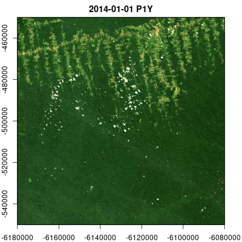

# gdalcubes 

[](https://github.com/appelmar/gdalcubes_R/actions/workflows/R-CMD-check.yml)
[](https://cran.r-project.org/package=gdalcubes)
[](https://cran.r-project.org/package=gdalcubes)

The R package `gdalcubes` aims at making analyses of large satellite
image collections easier, faster, more intuitive, and more interactive.

The package represents the data as *regular raster data cubes* with
dimensions `bands`, `time`, `y`, and `x` and hides complexities in the
data due to different spatial resolutions,map projections, data formats,
and irregular temporal sampling.

# Features

  - Read and process multitemporal, multispectral Earth observation
    image collections as *regular raster data cubes* by applying
    on-the-fly reprojection, rescaling, cropping, and resampling.
  - Work with existing Earth observation imagery on local disks or cloud
    storage without the need to maintain a 2nd copy of the data.
  - Apply user-defined R functions on data cubes.
  - Execute data cube operation chains using parallel processing and
    lazy evaluation.

Among others, the package has been successfully used to process data
from the Sentinel-2, Landsat, PlanetScope, MODIS, and Global
Precipitation Measurement Earth observation satellites / missions.

# Installation

Install from CRAN with:

``` r
install.packages("gdalcubes")
```

## From sources

Installation from sources is easiest with

``` r
remotes::install_git("https://github.com/appelmar/gdalcubes_R")
```

Please make sure that the [git command line
client](https://git-scm.com/downloads) is available on your system.
Otherwise, the above command might not clone the gdalcubes C++ library
as a submodule under src/gdalcubes.

The package builds on the external libraries
[GDAL](https://www.gdal.org),
[NetCDF](https://www.unidata.ucar.edu/software/netcdf),
[SQLite](https://www.sqlite.org), and
[curl](https://curl.haxx.se/libcurl).

## Windows

On Windows, you will need
[Rtools](https://cran.r-project.org/bin/windows/Rtools). System
libraries are automatically downloaded from
[rwinlib](https://github.com/rwinlib).

## Linux

Please install the system libraries e.g. with the package manager of
your Linux distribution. Also make sure that you are using a recent
version of GDAL (\>2.3.0). On Ubuntu, the following commands install all
libraries.

    sudo add-apt-repository ppa:ubuntugis/ppa && sudo apt-get update
    sudo apt-get install libgdal-dev libnetcdf-dev libcurl4-openssl-dev libsqlite3-dev libudunits2-dev

## MacOS

Use [Homebrew](https://brew.sh) to install system libraries with

    brew install pkg-config
    brew install gdal
    brew install netcdf
    brew install libgit2
    brew install udunits
    brew install curl
    brew install sqlite

# Getting started

## Download example data

``` r
if (!dir.exists("L8_Amazon")) {
  download.file("https://uni-muenster.sciebo.de/s/e5yUZmYGX0bo4u9/download", destfile = "L8_Amazon.zip")
  unzip("L8_Amazon.zip", exdir = "L8_Amazon")
}
```

## Creating an image collection

At first, we must scan all available images once, and extract some
metadata such as their spatial extent and acquisition time. The
resulting *image collection* is stored on disk, and typically consumes a
few kilobytes per image. Due to the diverse structure of satellite image
products, the rules how to derive the required metadata are formalized
as *collection\_formats*. The package comes with predefined formats for
some Sentinel, Landsat, and MODIS products (see `collection_formats()`
to print a list of available formats).

``` r
library(gdalcubes)

gdalcubes_options(parallel=8)

files = list.files("L8_Amazon", recursive = TRUE, 
                   full.names = TRUE, pattern = ".tif") 
length(files)
```

    ## [1] 1800

``` r
sum(file.size(files)) / 1024^2 # MiB
```

    ## [1] 1919.118

``` r
L8.col = create_image_collection(files, format = "L8_SR", out_file = "L8.db")
L8.col
```

    ## Image collection object, referencing 180 images with 10 bands
    ## Images:
    ##                                       name      left       top    bottom
    ## 1 LC08_L1TP_226063_20140719_20170421_01_T1 -54.15776 -3.289862 -5.392073
    ## 2 LC08_L1TP_226063_20140820_20170420_01_T1 -54.16858 -3.289828 -5.392054
    ## 3 LC08_L1GT_226063_20160114_20170405_01_T2 -54.16317 -3.289845 -5.392064
    ## 4 LC08_L1TP_226063_20160724_20170322_01_T1 -54.16317 -3.289845 -5.392064
    ## 5 LC08_L1TP_226063_20170609_20170616_01_T1 -54.17399 -3.289810 -5.392044
    ## 6 LC08_L1TP_226063_20170711_20170726_01_T1 -54.15506 -3.289870 -5.392083
    ##       right            datetime        srs
    ## 1 -52.10338 2014-07-19T00:00:00 EPSG:32622
    ## 2 -52.11418 2014-08-20T00:00:00 EPSG:32622
    ## 3 -52.10878 2016-01-14T00:00:00 EPSG:32622
    ## 4 -52.10878 2016-07-24T00:00:00 EPSG:32622
    ## 5 -52.11958 2017-06-09T00:00:00 EPSG:32622
    ## 6 -52.09798 2017-07-11T00:00:00 EPSG:32622
    ## [ omitted 174 images ] 
    ## 
    ## Bands:
    ##         name offset scale unit       nodata image_count
    ## 1    AEROSOL      0     1                           180
    ## 2        B01      0     1      -9999.000000         180
    ## 3        B02      0     1      -9999.000000         180
    ## 4        B03      0     1      -9999.000000         180
    ## 5        B04      0     1      -9999.000000         180
    ## 6        B05      0     1      -9999.000000         180
    ## 7        B06      0     1      -9999.000000         180
    ## 8        B07      0     1      -9999.000000         180
    ## 9   PIXEL_QA      0     1                           180
    ## 10 RADSAT_QA      0     1                           180

## Creating data cubes

To create a regular raster data cube from the image collection, we
define the geometry of our target cube as a *data cube view*, using the
`cube_view()` function. We define a simple overview, covering the full
spatiotemporal extent of the imagery at 1km x 1km pixel size where one
data cube cell represents a duration of one year. The provided
resampling and aggregation methods are used to spatially reproject,
crop, and rescale individual images and combine pixel values from many
images within one year respectively. The `raster_cube()` function
returns a *proxy* object, i.e., it returns immediately without doing any
expensive computations.

``` r
v.overview = cube_view(extent=L8.col, dt="P1Y", dx=1000, dy=1000, srs="EPSG:3857", 
                      aggregation = "median", resampling = "bilinear")
raster_cube(L8.col, v.overview)
```

    ## A data cube proxy object
    ## 
    ## Dimensions:
    ##                 low              high count pixel_size chunk_size
    ## t        2013-01-01        2019-12-31     7        P1Y          1
    ## y -764014.387686915 -205014.387686915   559       1000        192
    ## x -6582280.06164712 -5799280.06164712   783       1000        192
    ## 
    ## Bands:
    ##         name offset scale nodata unit
    ## 1    AEROSOL      0     1    NaN     
    ## 2        B01      0     1    NaN     
    ## 3        B02      0     1    NaN     
    ## 4        B03      0     1    NaN     
    ## 5        B04      0     1    NaN     
    ## 6        B05      0     1    NaN     
    ## 7        B06      0     1    NaN     
    ## 8        B07      0     1    NaN     
    ## 9   PIXEL_QA      0     1    NaN     
    ## 10 RADSAT_QA      0     1    NaN

## Processing data cubes

We can apply (and chain) operations on data cubes:

``` r
x = raster_cube(L8.col, v.overview) |>
  select_bands(c("B02","B03","B04")) |>
  reduce_time(c("median(B02)","median(B03)","median(B04)"))
x
```

    ## A data cube proxy object
    ## 
    ## Dimensions:
    ##                 low              high count pixel_size chunk_size
    ## t        2013-01-01        2019-12-31     1        P7Y          1
    ## y -764014.387686915 -205014.387686915   559       1000        192
    ## x -6582280.06164712 -5799280.06164712   783       1000        192
    ## 
    ## Bands:
    ##         name offset scale nodata unit
    ## 1 B02_median      0     1    NaN     
    ## 2 B03_median      0     1    NaN     
    ## 3 B04_median      0     1    NaN

``` r
plot(x, rgb=3:1, zlim=c(0,1200))
```

<!-- -->

``` r
library(RColorBrewer)
 raster_cube(L8.col, v.overview) |>
  select_bands(c("B04","B05")) |>
  apply_pixel(c("(B05-B04)/(B05+B04)"), names="NDVI") |>
  plot(zlim=c(0,1),  nbreaks=10, col=brewer.pal(9, "YlGn"), key.pos=1)
```

<!-- -->

Calling data cube operations always returns *proxy* objects,
computations are started lazily when users call e.g. `plot()`.

## Animations

Multitemporal data cubes can be animated (thanks to the [gifski
package](https://cran.r-project.org/package=gifski)):

``` r
v.subarea.yearly = cube_view(extent=list(left=-6180000, right=-6080000, bottom=-550000, top=-450000, 
                             t0="2014-01-01", t1="2018-12-31"), dt="P1Y", dx=50, dy=50,
                             srs="EPSG:3857", aggregation = "median", resampling = "bilinear")

raster_cube(L8.col, v.subarea.yearly) |>
  select_bands(c("B02","B03","B04")) |>
  animate(rgb=3:1,fps = 2, zlim=c(100,1000), width = 400, 
          height = 400, save_as = "man/figures/animation.gif")
```



## Data cube export

Data cubes can be exported as single netCDF files with `write_ncdf()`,
or as a collection of (possibly cloud-optimized) GeoTIFF files with
`write_tif()`, where each time slice of the cube yields one GeoTIFF
file. Data cubes can also be converted to `raster` or `stars`objects:

``` r
raster_cube(L8.col, v.overview) |>
  select_bands(c("B04","B05")) |>
  apply_pixel(c("(B05-B04)/(B05+B04)"), names="NDVI") |>
  write_tif() |>
  raster::stack() -> x
x
```

    ## class      : RasterStack 
    ## dimensions : 559, 783, 437697, 7  (nrow, ncol, ncell, nlayers)
    ## resolution : 1000, 1000  (x, y)
    ## extent     : -6582280, -5799280, -764014.4, -205014.4  (xmin, xmax, ymin, ymax)
    ## crs        : +proj=merc +a=6378137 +b=6378137 +lat_ts=0 +lon_0=0 +x_0=0 +y_0=0 +k=1 +units=m +nadgrids=@null +wktext +no_defs 
    ## names      : NDVI.1, NDVI.2, NDVI.3, NDVI.4, NDVI.5, NDVI.6, NDVI.7

``` r
raster_cube(L8.col, v.overview) |>
  select_bands(c("B04","B05")) |>
  apply_pixel(c("(B05-B04)/(B05+B04)"), names="NDVI") |>
  stars::st_as_stars() -> y
y
```

    ## stars object with 3 dimensions and 1 attribute
    ## attribute(s), summary of first 1e+05 cells:
    ##             Min.   1st Qu.   Median      Mean  3rd Qu.      Max.  NA's
    ## NDVI  -0.5595199 0.4207425 0.723503 0.5765454 0.849606 0.8892204 79500
    ## dimension(s):
    ##      from  to   offset delta                   refsys point
    ## x       1 783 -6582280  1000 WGS 84 / Pseudo-Mercator    NA
    ## y       1 559  -205014 -1000 WGS 84 / Pseudo-Mercator    NA
    ## time    1   7       NA    NA                  POSIXct FALSE
    ##                                                   values x/y
    ## x                                                   NULL [x]
    ## y                                                   NULL [y]
    ## time [2013-01-01,2014-01-01),...,[2019-01-01,2020-01-01)

To reduce the size of exported data cubes, compression and packing
(conversion of doubles to smaller integer types) are supported.

If only specific time slices of a data cube are needed, `select_time()`
can be called before plotting / exporting.

``` r
raster_cube(L8.col, v.overview) |>
  select_bands(c("B04","B05")) |>
  apply_pixel(c("(B05-B04)/(B05+B04)"), names="NDVI") |>
  select_time(c("2015", "2018")) |>
  plot(zlim=c(0,1), nbreaks=10, col=brewer.pal(9, "YlGn"), key.pos=1)
```

<!-- -->

## User-defined functions

Users can pass custom R functions to `reduce_time()` and
`apply_pixel()`. Below, we derive a *greenest pixel composite* by
returning RGB values from pixels with maximum NDVI for all pixel
time-series.

``` r
v.subarea.monthly = cube_view(view = v.subarea.yearly, dt="P1M", dx = 100, dy = 100,
                              extent = list(t0="2015-01", t1="2018-12"))
raster_cube(L8.col, v.subarea.monthly) |>
  select_bands(c("B02","B03","B04","B05")) |>
  apply_pixel(c("(B05-B04)/(B05+B04)"), names="NDVI", keep_bands=TRUE) |>
  reduce_time(names=c("B02","B03","B04"), FUN=function(x) {
    if (all(is.na(x["NDVI",]))) return(rep(NA,3))
    return (x[c("B02","B03","B04"), which.max(x["NDVI",])])
  }) |>
  plot(rgb=3:1, zlim=c(100,1000))
```

<!-- -->

## Extraction of pixels, time series, and summary statistics over polygons

In many cases, one is interested in extracting sets of points, time
series, or summary statistics over polygons, e.g., to generate training
data for machine learning models. Package version 0.6 therefore
introduces the `extract_geom()` function, which replaces the previous
implementations in `query_points()`, `query_timeseries()`, and
`zonal_statistics()`.

Below, we randomly select 100 locations and query values of single data
cube cells and complete time series.

``` r
x = runif(100, v.overview$space$left, v.overview$space$right)
y = runif(100, v.overview$space$bottom, v.overview$space$top)
t = sample(as.character(2013:2019), 100, replace = TRUE)
df = sf::st_as_sf(data.frame(x = x, y = y), coords = c("x", "y"), crs = v.overview$space$srs)

# spatiotemporal points
raster_cube(L8.col, v.overview) |>
  select_bands(c("B04","B05")) |>
  extract_geom(df, datetime = t) |>
  dplyr::sample_n(15) # print 15 random rows
```

    ##    FID       time      B04      B05
    ## 42  13 2019-01-01 528.6972 2642.340
    ## 39  61 2019-01-01 171.6595 2864.671
    ## 18  11 2014-01-01 491.0714 3093.513
    ## 9    3 2014-01-01 229.4688 1846.892
    ## 19  85 2015-01-01 196.6346 2949.415
    ## 28  38 2016-01-01 284.4181 3058.162
    ## 16  70 2014-01-01 204.4690 3153.227
    ## 64  68 2019-01-01 314.5702 2602.949
    ## 15  79 2015-01-01 372.4574 2985.155
    ## 52   2 2019-01-01 194.7523 2932.755
    ## 17  14 2014-01-01 195.4712 2892.836
    ## 35  86 2016-01-01 251.5154 3109.103
    ## 47  23 2019-01-01 367.7108 3223.365
    ## 33  93 2015-01-01 551.6841 3367.454
    ## 37   5 2016-01-01 213.2052 2887.869

``` r
# time series at spatial points
raster_cube(L8.col, v.overview) |>
  select_bands(c("B04","B05")) |>
  extract_geom(df) |>
  dplyr::sample_n(15) # print 15 random rows
```

    ##     FID       time      B04      B05
    ## 441  61 2018-01-01 248.7178 2780.589
    ## 264  74 2018-01-01 173.8156 2929.278
    ## 122  50 2014-01-01 174.2775 2756.543
    ## 73   20 2014-01-01 187.1711 2840.537
    ## 124  75 2014-01-01 233.2986 3204.541
    ## 80   80 2014-01-01 167.6043 3001.744
    ## 352  13 2017-01-01 246.5017 3140.106
    ## 157  35 2015-01-01 227.6701 2921.447
    ## 309  22 2016-01-01 558.1645 3572.036
    ## 280  28 2018-01-01 157.5138 2545.733
    ## 331  16 2017-01-01 233.3473 3042.368
    ## 336  17 2017-01-01 186.0070 3002.936
    ## 239  55 2017-01-01 771.2047 3188.574
    ## 384  30 2018-01-01 295.9505 3397.156
    ## 190  58 2015-01-01 306.0879 3025.997

In the following, we use the example Landsat dataset (reduced
resolution) from the package and compute median NDVI values within some
administrative regions in New York City. The result is a data.frame
containing data cube bands, feature IDs, and time as columns.

``` r
L8_files <- list.files(system.file("L8NY18", package = "gdalcubes"),
                       ".TIF", recursive = TRUE, full.names = TRUE)
v = cube_view(srs="EPSG:32618", dy=300, dx=300, dt="P1M", 
              aggregation = "median", resampling = "bilinear",
              extent=list(left=388941.2, right=766552.4,
                          bottom=4345299, top=4744931, 
                          t0="2018-01", t1="2018-12"))
sf = sf::st_read(system.file("nycd.gpkg", package = "gdalcubes"), quiet = TRUE)

raster_cube(create_image_collection(L8_files, "L8_L1TP"), v) |>
  select_bands(c("B04", "B05")) |>
  apply_pixel("(B05-B04)/(B05+B04)", "NDVI") |>
  extract_geom(sf, FUN = median) -> zstats

dplyr::sample_n(zstats, 15) # print 15 random rows
```

    ##    FID       time         NDVI
    ## 1   47 2018-12-01 -0.003722353
    ## 2   43 2018-03-01  0.022954312
    ## 3   57 2018-12-01  0.053809129
    ## 4   22 2018-08-01  0.143675695
    ## 5    7 2018-05-01  0.071711941
    ## 6   15 2018-04-01  0.059019065
    ## 7   56 2018-12-01  0.048132687
    ## 8    9 2018-06-01  0.082063801
    ## 9   35 2018-01-01  0.016194754
    ## 10  33 2018-04-01  0.086141534
    ## 11  59 2018-05-01  0.047808749
    ## 12  64 2018-06-01  0.040585707
    ## 13   1 2018-04-01  0.033851363
    ## 14  31 2018-07-01  0.071683399
    ## 15  27 2018-09-01  0.090892190

We can combine the result with the original features by a table join on
the FID column using `merge()`:

``` r
sf$FID = rownames(sf)
x = merge(sf, zstats, by = "FID")
plot(x[x$time == "2018-07-01", "NDVI"])
```

<!-- -->

When using input features with additional attributes / labels, the
`extract_geom()` function hence makes it easy to create training data
for machine learning models.

# More Features

**Cloud support with STAC**: `gdalcubes` can be used directly on cloud
computing platforms including Amazon Web Services, Google Cloud
Platform, and Microsoft Azure. Imagery can be read from their open data
catalogs and discovered by connecting to STAC API endpoints using the
[`rstac` package](https://cran.r-project.org/package=rstac) (see links
at the end of this page).

**Masks**: Mask bands (e.g. general pixel quality measures or cloud
masks) can be applied during the construction of the raster data cube,
such that masked values will not contribute to the data cube values.

**Further operations**: The previous examples covered only a limited set
of built-in functions. Further data cube operations for example include
spatial and/or temporal slicing (`slice_time`, `slice_space`), cropping
(`crop`), apply moving window filters over time series (`window_time`),
filtering by arithmetic expressions on pixel values and spatial
geometries (`filter_pixel`, `filter_geom`), and combining two or more
data cubes with identical shape (`join_bands`).

# Limitations

  - Data cubes are limited to four dimensions
    ([stars](https://cran.r-project.org/package=stars) has cubes with
    any number of dimensions).
  - Some operations such as `window_time()` do not support user-defined
    R functions at the moment.
  - Images must be orthorectified / regularly gridded; there is no
    support for curvilinear grids.
  - There is no support for vector data cubes
    ([stars](https://cran.r-project.org/package=stars) has vector data
    cubes).

# Further reading

  - [Official R package website](https://gdalcubes.github.io)
  - [Tutorial on YouTube](https://youtu.be/Xlg__2PeTXM?t=3693) how to
    use gdalcubes in the cloud, streamed at OpenGeoHub Summer School
    2021
  - [1st blog post on
    r-spatial.org](https://www.r-spatial.org/r/2019/07/18/gdalcubes1.html)
  - [2nd blog post on
    r-spatial.org](https://r-spatial.org/r/2021/04/23/cloud-based-cubes.html)
    describing how to use gdalcubes in cloud-computing environments
  - [Open access paper](https://www.mdpi.com/2306-5729/4/3/92) in the
    special issue on Earth observation data cubes of the data journal
